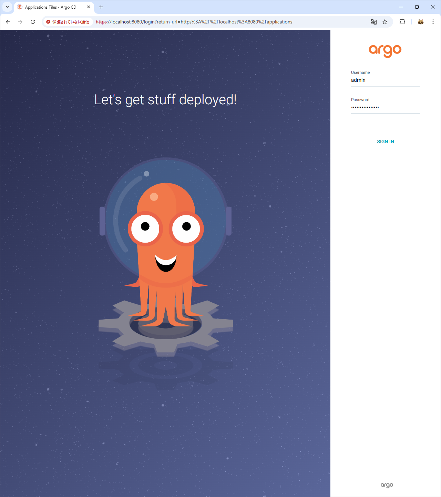

# Deploy apps with argocd & helmfile

## Install required helm plugins

```console
❯ helm plugin install https://github.com/databus23/helm-diff
<omit>

❯ helm plugin install https://github.com/jkroepke/helm-secrets
<omit>

❯ helm plugin list
NAME    VERSION         DESCRIPTION
diff    3.9.13          Preview helm upgrade changes as a diff
secrets 4.6.3-dev       This plugin provides secrets values encryption for Helm charts secure storing
```

## Deploy apps with helmfile

```console
❯ cd helmfile

❯ age-keygen -o key.txt

❯ vi .sops.yaml

❯ rm github-arc/secrets/arc-runner-set-poc.yaml

❯ vi github-arc/secrets/arc-runner-set-poc.yaml

❯ helm secrets encrypt -i github-arc/secrets/arc-runner-set-poc.yaml

❯ helmfile diff --environment $HELM_ENVIRONMENT --selector name=argocd
<omit>

❯ helmfile apply --environment $HELM_ENVIRONMENT --selector name=argocd
<omit>
```

## Login argocd web UI

```console
❯ kubectl -n argocd get secret argocd-initial-admin-secret -o jsonpath="{.data.password}" | base64 -d
<admin user password>

❯ kubectl port-forward service/argocd-server --namespace argocd 8080:443
```

<https://localhost:8080/>



## Create the argocd app

```console
❯ kubectl apply -f tmp/my-apps.yaml
application.argoproj.io/my-apps created
```
